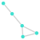
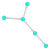
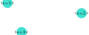
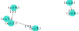
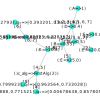
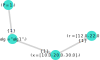
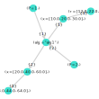

# StorageGraphs

[](https://SebastianM-C.github.io/StorageGraphs.jl/stable)
[](https://SebastianM-C.github.io/StorageGraphs.jl/dev)
[](https://travis-ci.com/SebastianM-C/StorageGraphs.jl)
[](https://ci.appveyor.com/project/SebastianM-C/StorageGraphs-jl)
[](https://codecov.io/gh/SebastianM-C/StorageGraphs.jl)

This is an _experimental_ package for storing hierarchical data in graphs in a non-redundant way.
This package aims to be useful when one has a combination of data and metadata or parameters
and the use of tables would lead to a lot of redundancy in the corresponding columns.

### Introduction

In general a graph is a collection of objects with some relations between them.
If we describe the graph from a mathematical point of view, the objects correspond
to vertices and the relations to edges. Graphs can be represented by diagrams.
For example:

|                 Simple graph            |        Simple directed graph
:----------------------------------------:|:-------------------------------------------:
 | 

If the vertices have a direction, we call them directed graphs. We can use graphs
to store data. To do this we will use a (directed) graph and associate metadata
to the vertices and the edges. Each vertex will contain some data and the edges
will provide the required connections. More precisely, a path will be associated
with the (ordered) set of data entries. We will call a node a vertex
and its associated metadata and a path will be the collection of all edges (identified
by an id). For example if we have `x = [1, 2, 3]`, then the graph looks like this:



Now, let's consider that we have a function, say `f(x) = x^2`, and we apply it
to our `x` and want to store the resulting `y = [1, 4, 9]`. We encode
the fact that `y` was derived / computed from `x` by using edges oriented from
the `x` nodes to the `y` nodes. This creates a hierarchy in the data.
Moreover, to use the graph efficiently, we can store all the entries of `x`
in a node (and similar for `y`).
We can compare the graph and the table representations:

<table>
  <tr>
    <th>

|  id   |   x   |   y   |
|-------|-------|-------|
|   1   |   1   |   1   |
|   2   |   2   |   4   |
|   3   |   3   |   9   |

</th>
    <th>

    </th>
  </tr>
</table>

### Implementation

In this package we use `NamedTuple`s to specify the information contained in the nodes.
To specify the dependencies between nodes we use (nested) pairs(`=>`).
For example, for generating the above graph
we can use:

```julia
using StorageGraphs

g = StorageGraph()
add_nodes!(g, (x=[1,2,3],)=>(y=[1,4,9],))
```

Note: `NamedTuple`s with a single element must use a comma.
(`(a=1,)` is not the same as `(a=1)`)

This package provides a custom a `AbstractGraph` type called `StorageGraph`
(similar to `MetaDiGraph`s in [MetaGraphs.jl](https://github.com/JuliaGraphs/MetaGraphs.jl)).
The metadata is stored in dictionaries with the keys being given by vertices or edges.
For nodes the data is in the `g.data` field, while for edges in `g.paths`.
The nodes of the graph can be found via the inverse dictionary `g.index` in
which the keys are given by the data. The main search tool in the graph is
the overloaded `getindex` function.

- One way to search is by symbols. For example, for the above graph `g[:x]`
will give all the values corresponding to `:x` (`[1,2,3]`).
**Important Note**: the order of the values is not necessary the same as the
order given when the data was added. This is because the order of the edges
in the graph is not inherently defined. This way of searching is equivalent with
searching on columns in a table.

- Other ways of searching take advantage of the graph structure. For example we
could search for the nodes which descend from a given hierarchy. This requires a
more complicated graph structure to exemplify, so concrete examples will be provided
later.

## Tutorial and motivation

Let us consider that we have some simulation data with the following structure:
* simulation parameters: `P`  which takes a value or each simulation.
* initial conditions: for each `P` we have an algorithm that generates some
initial conditions. The algorithm itself may have parameters.
* simulation results: for each initial conditions the simulation produces some results
(we can think of this as being a function of the initial conditions as illustrated
in the Introduction).

We will now progressively build up the graph. Let's say that the first simulation
has `P=1` and using `"alg1"` we generated some initial conditions (`x`).

```julia
using StorageGraphs

g = StorageGraph()

add_nodes!(g, (P=1,)=>(alg="alg1",)=>(x=[10., 20., 30.],))
```
Up to this point the graph and the equivalent table are presented below:

<table>
  <tr>
    <th>

| id | P | alg  | x |
|----|---|------|---|
| 1  | 1 |"alg1"|10.|
| 2  | 1 |"alg1"|20.|
| 3  | 1 |"alg1"|30.|

</th>
    <th>
      
  </th>
  </tr>
  </table>

For the initial conditions we used a node for the algorithm (containing the name)
and one for each of the produced values. Next, we will obtain our simulation results
and add them to the graph.
Note: It is crucial that we load the initial conditions from the graph since
we must get them in the correct order.
```julia
# retrieve the previously stored initial conditions
x = g[:x, (P=1,)=>(alg="alg1",)][1]
# there is only one node depending on (P=1,)=>(alg="alg1",), so that's why
# we take only the first element
results = simulation(x, alg="alg1")
add_nodes!(g, foldr(=>, ((P=1,), (alg="alg1",), (x=x,), (r=results,))))
# foldr(=>, dep) can be useful for building long dependency chanis form parts
```

Here we presented another way of querying the graph. We used the fact
the initial conditions depend on the previously stored parameters
and we retrieved them based on the hierarchy.
After this step we have

<table>
  <tr>
    <th>

| id | P | alg  | x | r |
|----|---|------|---|---|
| 1  | 1 |"alg1"|10.|12.|
| 2  | 1 |"alg1"|20.|22.|
| 3  | 1 |"alg1"|30.|32.|

</th>
<th>
  
  </th>
  </tr>
  <table>

Now consider what would happen if in a second simulation we would have
`P=2`, but still `"alg1"`. As we can see with increasing complexity
the columns corresponding to simulation parameters or metadata would
contain a lot of redundant information. In the graph we can only store
them once and keep track of things through paths. This is the main
motivation for this package.

<table>
  <tr>
    <th>

| id | P | alg  | x | r |
|----|---|------|---|---|
| 1  | 1 |"alg1"|10.|12.|
| 2  | 1 |"alg1"|20.|22.|
| 3  | 1 |"alg1"|30.|32.|
| 4  | 2 |"alg1"|20.|24.|
| 5  | 2 |"alg1"|40.|44.|
| 6  | 2 |"alg1"|60.|64.|

</th>
<th>
  
  </th>
  </tr>
  </table>
