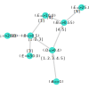

# GraphStorage

[](https://SebastianM-C.github.io/GraphStorage.jl/stable)
[](https://SebastianM-C.github.io/GraphStorage.jl/latest)
[](https://travis-ci.com/SebastianM-C/GraphStorage.jl)
[](https://ci.appveyor.com/project/SebastianM-C/GraphStorage-jl)
[](https://codecov.io/gh/SebastianM-C/GraphStorage.jl)

This is an _experimental_ package for storing hierarchical data in graphs.
The data is stored within the properties of the vertices of a directed graph
(a `MetaDiGraph` from [MetaGraphs.jl](https://github.com/JuliaGraphs/MetaGraphs.jl))
and data points are identified by a path through the graph. A path is a collection
of edges with the same label (a dictionary with a key `id` corresponding to the
index of the path).

If one would think of an analogy with a table, the rows of the table correspond
to a path through the graph.

## Tutorial and motivation

Let us consider that we have some simulation data with the following structure:
* simulation parameters: tow constant parameters `A` and `D`, a variable parameter `B`.
* physical parameters: for each simulation parameter we have an `E`.
* initial conditions: for each combination of parameters we have an algorithm that
generates some initial conditions. The algorithm itself also has some parameters and
their number may vary depending on the algorithm. The for each combination of parameters
and choice of algorithm we have a number of initial conditions.
* simulation results: for each initial conditions the simulation produces some results
(in 1-to-1 correspondence with the initial conditions).

We will now progressively build up the graph.
For the parameters `A`, `D`, `B` and `E` we will use some nodes connected in
such away that it reflects their dependence. More concretely

```julia
using LightGraphs, MetaGraphs
using GraphStorage

g = MetaDiGraph()
indexby(g, :B)
indexby(g, :E)

# We can add the nodes progressively
add_nodes!(g, (A=1,)=>(D=0.4,)=>(B=0.5,))
# or in bulk
add_bulk!(g, (A=1,)=>(D=0.4,)=>(B=0.5,), (E=[10., 20., 30.],))
add_bulk!(g, (A=1,)=>(D=0.4,)=>(B=0.55,), (E=[10., 25.],))
```
Up to this point the graph looks like this:



Next, for the initial conditions we will use a node for the algorithm and one
for each of the produced values.
Suppose that we have the following initial conditions algorithms:
```julia
using Parameters

abstract type AbstractAlgorithm end
abstract type InitialConditionsAlgorithm <: AbstractAlgorithm end

@with_kw struct FirstAlg <: InitialConditionsAlgorithm
    n::Int
    @assert n > 0
end

@with_kw struct SecondAlg <: InitialConditionsAlgorithm
    n::Int
    x::Bool
end

function initial_conditions(alg::FirstAlg)
    n = alg.n
    q₀ = [rand(2) for _=1:n]
    q₂ = [rand(2) for _=1:n]
    return q₀, q₂
end

function initial_conditions(alg::SecondAlg)
    @unpack n, x = alg
    q₀ = [x ? rand(2) : 10 .+ rand(2) for _=1:n]
    q₂ = [x ? rand(2) : 10 .+ rand(2) for _=1:n]
    return q₀, q₂
end
```

Then adding initial conditions would look like this:
```julia
dep = (A=1,)=>(D=0.4,)=>(B=0.55,)=>(E=10.,)=>(ic_alg=FirstAlg(2),)
q₀, q₂ = initial_conditions(FirstAlg(2))
add_bulk!(g, dep, (q₀=q₀, q₂=q₂))

dep = (A=1,)=>(D=0.4,)=>(B=0.5,)=>(E=10.,)=>(ic_alg=SecondAlg(2, true),)
q₀, q₂ = initial_conditions(SecondAlg(2, true))
add_bulk!(g, dep, (q₀=q₀, q₂=q₂))
```
As an observation, the use of a node containing the whole `struct` instead of
individual nodes for each property is that it creates namespace separation.
At this point the graph looks like this:


Next, we pass to simulation results. We will again use a node for the algorithm
and one for each of the results. Let's consider that we have the following algorithms:
```julia
abstract type SimulationAlgorithm <: AbstractAlgorithm end
using LinearAlgebra

@with_kw struct Alg1{R <: Real} <: SimulationAlgorithm @deftype R
    a = 10.
    b = 0.1
end

@with_kw struct Alg2{R <: Real} <: SimulationAlgorithm @deftype R
    a = 100.
end

function sim1(q₀, q₂, alg::Alg1)
    @unpack a, b = alg
    @assert axes(q₀) == axes(q₂)
    return [(a.*q₀[i]) ⋅ (b.*q₂[i]) for i in axes(q₀, 1)]
end

function sim2(q₀, q₂, alg::Alg2)
    a = alg.a
    @assert axes(q₀) == axes(q₂)
    return a*[norm(q₀[i] - q₂[i]) for i in axes(q₀, 1)]
end
```
To add some simulation results to the graph we can use the following:
```julia
ic_dep = (A=1,)=>(D=0.4,)=>(B=0.55,)=>(E=10.,)=>(ic_alg=FirstAlg(2),)
q₀, q₂ = initial_conditions(FirstAlg(2))

l = sim1(q₀, q₂, Alg1())


```
